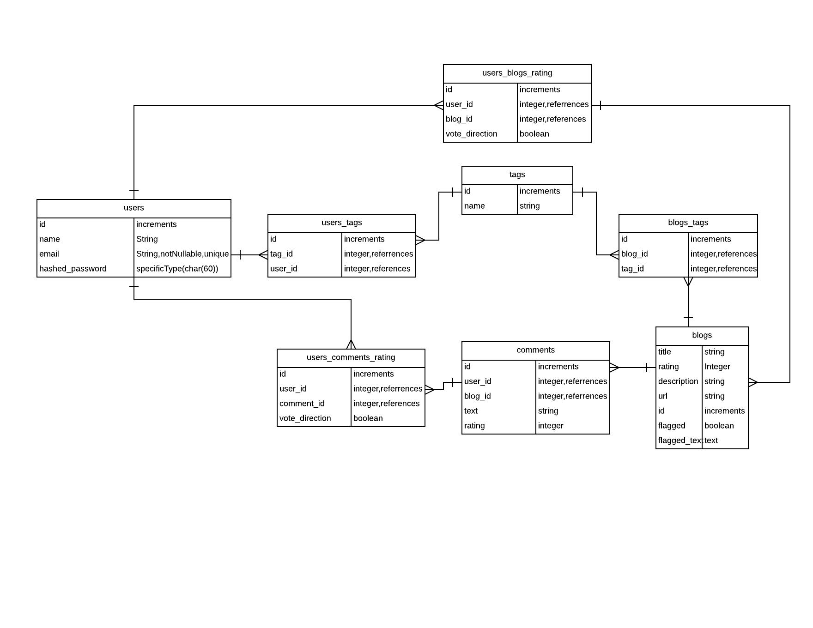

# pinpoint

### Definition:
A community driven blog management and discovery platform.

### Problem Statement:
Modern people face two intertwining problems. Extensive content optionality, and limited time. Information is available and easily accessible on any imaginable topic. This information exists in vast quantities, but varying qualities.

This begs the question, how does a busy person utilize their limited time most effectively? How can someone be sure that the blogs they are perusing offer the best bang for the buck?

That's where pinpoint comes in. We offer tools for the community to classify blogs according to topics covered, and rate those blogs according to quality. Out of the aggregation of our users knowledge and expertise, we are able to curate a set of high quality content that is relevant to our users preferences.

### Getting started:
[Check out our site!](https://pinpointblogs.herokuapp.com/blogs)

<iframe width="560" height="315" src="https://www.youtube.com/embed/mAcB3AQre6c" frameborder="0" allowfullscreen></iframe>

<iframe width="560" height="315" src="https://www.youtube.com/embed/Zk5u7ppFR9Q" frameborder="0" allowfullscreen></iframe>

<iframe width="560" height="315" src="https://www.youtube.com/embed/JjOyUKJOt_M" frameborder="0" allowfullscreen></iframe>

### Technology Used:
* HTML
* Bootstrap
* JavaScript
* Knex.js
* fuse.js
* sockets.io

### Entity Relationship Diagram:

